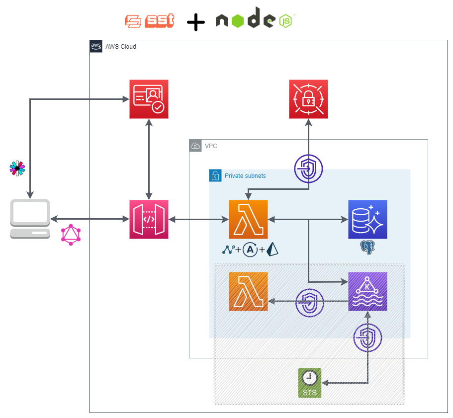

## TODOs

- [ ] **Error handling** 
- [ ] Decide best method to **generate PRISMA** (and maybe NEXUS) neccesary files
- [ ] Decide how **Migrations** will be implemented
- [ ] Define **Authorized entities** and their scopes
- [ ] Define how to **produce to Kafka** (partitions, topics, messages...)

## Schema

# Steps followed, and considerations:

We have used the SST framework to deploy our app. This framework has constructs for serverless AWS services. Because we are using some other services and advance options we also use some CDK constructs.

First of all, mention that in this project we have **separated the CDK code** (used to create the infra) **from the SDK code** (used to access and manage the resources) as a best practice. Sometimes both tools share some methods, which means that some operations can be done in both ways.

## 1. Infra: 

Create a **SST app, with JS** (In MyStack, add all the infra needed).

**Prisma currently do not support using the Data API endpoint** to access the serverless RDS cluster (**Aurora Serverless v1**). That is why we are going to use standard connection to the DB, so the **Lambda function must be in the same VPC as the cluster**, in order to connect to it.

The RDS credentials will be stored in Secret Manager, which allows us to rotate them and keep them secure. In order to get the RDS credentials, our Lambda need to connect to Secret Manager service, so we need to **add a VPC endpoint** for this.

The credentials will be retrieve during execution time. So in our code we use the SDK for JS, and outside the handler, in the Context, we get the credentials.

Our **Lambda function will also produce messages to a MSK** cluster, to show how to communicate two different domains.

The **MSK cluster can be a standard one or a serverless** one (since 17-08-2022 MSK Serverless support added to Cloudformation). Some differences between them:

 - If MSK serverless, the consumer Lambda function needs the: *kafka:DescribeClusterV2* permission.
 - MSK serverless cluster, has not got the: *clusterMSK.bootstrapBrokersTls* property, used to pass the producer Lambda function how to connect the cluster (so another way must be implemented, for example using the SDK at running time).
 - MSK serverless cluster comes with *IAM auth* (you cannot disabled it), so its something you need to take in account in the producer code while trying to connect to the cluster. (see after)

The MSK, in order to be able to trigger the Lambda function that will be consuming its data, needs to connect to the **STS API** (to get token) and the **Lambda API**, so we also needs these **VPC endpoints**.
When creating the MSK Lambda trigger, we need to specify a kafka **TOPIC**. This won't raise an error during deployment if this Topic is not yet created, and when the Topic is created the trigger will automatically change its status to OK.

The SST API allows us to configure defaults configurations for all routes or specify each one separately (the per route configuration values will overrride the defaults). In our case, we have only ONE route, so we can just specify its config in the API defaults.

The API constructor, acepts Cognito user pool as authorizer, but in this code we have just used **JWT authorizer** (which can be also a Cognito user pool and any other JWT provider) to show how to pass a Cognito user pool in this way.

**Prisma** (with its own commands) and **Nexus** (at runtime with a flag activated) generate code and libraries that our Lambda function will use. In this code we have chosen to generate this code firstly in dev (locally) and then bundle it to the Lambda function package that will be upload to AWS. 
Other options are:

 - Create a *Lambda layer* with all these artifact (generating them locally too) and upload it. These aproach could be usefull for projects in which there are couple of Lambda functions than use this same generated code.
 - Other option is to add *commandHooks*, and specify in them the Prisma command to generate the client.

## 2. The logic:

### Server:
The app code uses **Apollo Server**, implementing apollo-server-lambda. While instantiating the server, we only need to pase the schema and the context.

Then we only need to export the handler.

### Context:
In the Context, we connect  to the Secret Manager to retrieve the RDS credential and using it we instantiate the Prisma Client,  (this happens only the first time, after that, if the Lambda function instance is reutilize it will have charged this Prisma Client). BEST PRACTICE

#### Prisma Client:
In order to genererate the Prisma Client, we use the *prisma generate* command, which using the *schema.prisma* builds the code necessary. Generating the *schema.prisma* could be done through introspection (*prisma db pull*, using a previous DB) or directly writting it down (our case). With *prisma migrate*, you can generate a sql migration file to load the DB.
#### Auth:
This Context is also recommended to be used to allocate the user auth info, in this case we pass the username and the usergroup. This info cames in the request.requestContext.authorizer.jwt.claims field (added in the API GW).

### Schema:
Here we use Nexus to define our schema types. We also indicate how each type must be resolve using the Prisma Client instantiated in the Context: context.prisma.Client. 

With each Mutation we also want the Lambda function to send a message to MSK, for this we use the methods defined in *msk/producer* (to connect and send messages to topics). We have been using the *kafkajs* library. If the cluster has IAM authentication (for example MSK serverless) we have used the *@jm18457/kafkajs-msk-iam-authentication-mechanism* package which implements the way to connect to the cluster. (*MAYBE all the code related to MSK connection and initialization should be moved to the Context*)

With the *makeSchema* method from Nexus we generate the schema that Apollo Server will use. In this method we can configure the flag to generate the nexus artifacts and the *schema.graphql* file, we can also pass info about the context and the sourcetypes (prisma).

After that we merge this schema with one with the permissions. In order to apply this we have use *graphql-shield* which is a wrapper middleware that allows us to define rules and attach them to queries and mutations. These rules are based in the Auth info loaded in the Context with the Cognito info.

## 3. Testing:
SST allows you to debug and test the app locally with the **Live Lambda** feature (sst start).
This option **DOES NOT WORK with DB connections inside a VPC** (not using the Data API), so Prisma will not work. To make it works, there is a workaround in which you need to set up a VPN (not tested).

Once the whole app is deployed to AWS (sst deploy), you need to **initialize the RDS**. For example using the DATA API through the **SST console** and apply a migration or through the **AWS query editor** (Aurora Serverless v1) with a file as the *migration.sql* included (generated with *prisma migrate*).

As our app use Cognito User Pool as Authorizer with JWT, we need to set up a user and **get the tokens** to pass them in our calls. You can do this through the web console directly, CDK has constructs to generate users and groups in Cognito (*CfnUserPoolUser* and *CfnUserPoolGroup*), but we have use the CLI commands for this:

    aws cognito-idp sign-up --client-id XXXXX --username "test@test.com" --password "Password123_"
    aws cognito-idp admin-confirm-sign-up --user-pool-id us-west-2_YYYYYY --username "test@test.com"
    aws cognito-idp initiate-auth --auth-flow USER_PASSWORD_AUTH --auth-parameters USERNAME="test@test.com",PASSWORD="Password123_" --client-id XXXXXX

The *client-id* and the *user-pool-id* are passed to the output of the infra too.

Then you can just call the API GW endpoint (output of the infra) and start querying with GraphQL, for example using Postman.

